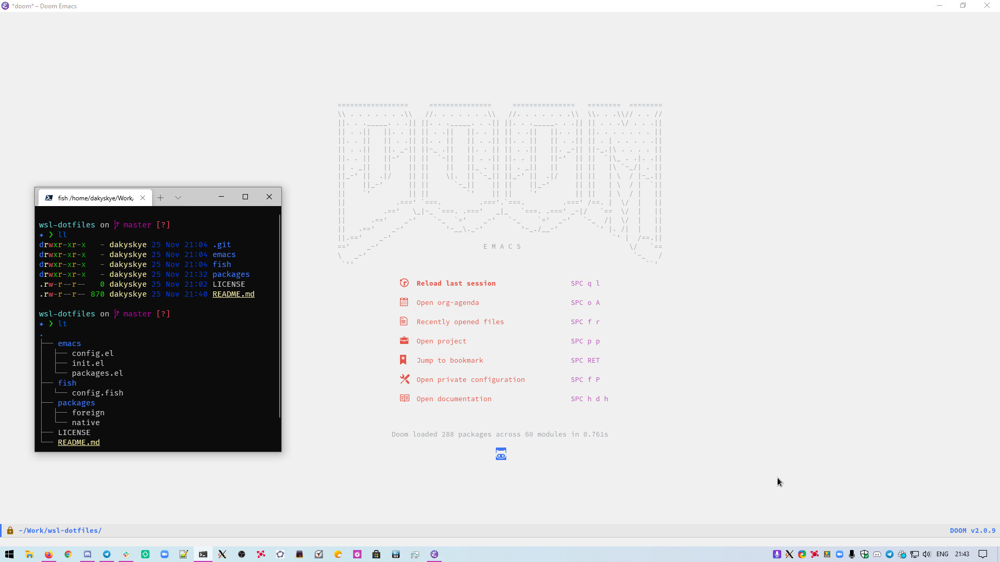

# wsl-dotfiles

This repository contains my WSL dotfiles.
Those configs are everything I need on Windows to feel like developer environment.

My Linux dotfiles lie [there](https://github.com/dakyskye/dotfiles).

## Setup guide

* get [WSL2](https://docs.microsoft.com/en-us/windows/wsl/install-win10) working.

* install [ArchWSL](https://github.com/yuk7/ArchWSL).

* install [VcXsrv](https://sourceforge.net/projects/vcxsrv/).

* install [configs](#configs) (fish profile is important, it exports a required `$DISPLAY` variable).

* launch `VcXsrv` with `-ac` flag.

* launch GUI programs (I only use Emacs) from cmdline, they will launch as if they were Windows natives.
